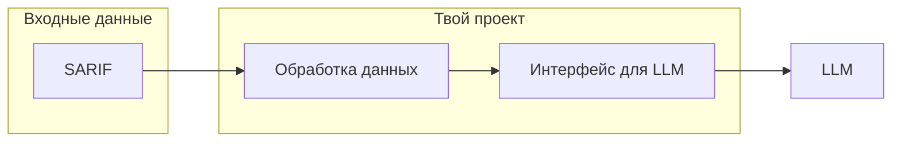

```mermaid
flowchart LR
    subgraph External1["Входные данные"]
        A[SARIF]
    end
    subgraph Core["Твой проект"]
        B[Обработка данных]
        C[Интерфейс для LLM]
    end
    D[LLM]
    A --> B
    B --> C
    C --> D
```
