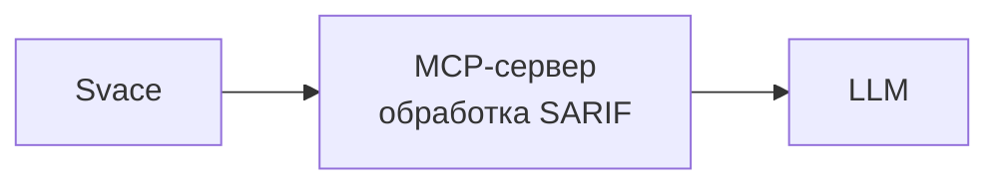
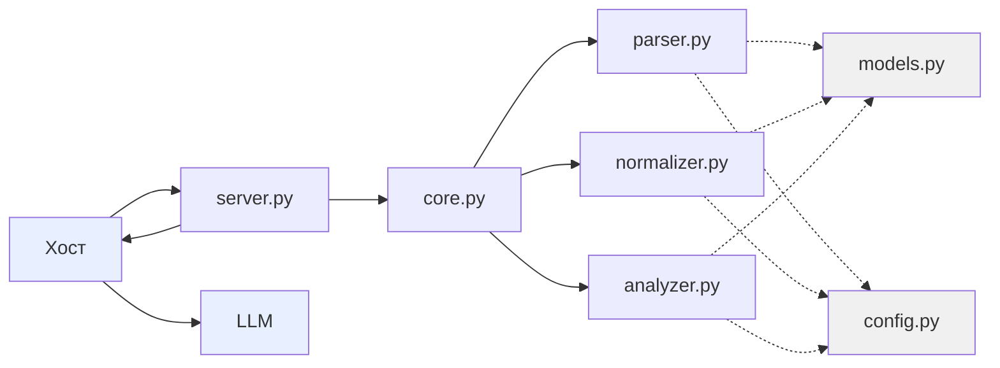

## 1. Высокоуровневая архитектура

```mermaid
flowchart LR
    Svace["Svace"] --> System["MCP-сервер<br/>обработка SARIF"] --> LLM["LLM"]
```

## 2. Декомпозиция компонентов

```mermaid
flowchart LR
    Host["Хост"]
    S["server.py"]
    C["core.py"]
    P["parser.py"]
    N["normalizer.py"]
    A["analyzer.py"]
    M["models.py"]
    CFG["config.py"]
    LLM["LLM"]

    Host --> S
    S --> C
    C --> P
    C --> N
    C --> A
    P -.-> M
    N -.-> M
    A -.-> M
    P -.-> CFG
    N -.-> CFG
    A -.-> CFG
    S --> Host
    Host --> LLM

    style M fill:#f0f0f0
    style CFG fill:#f0f0f0
    style Host fill:#e8f0ff
    style LLM fill:#e8f0ff
```

## 3. Потоки данных
