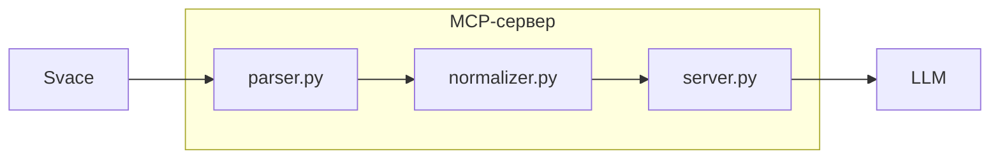

```mermaid
flowchart LR
    Svace["Svace"]
    LLM["LLM"]

    subgraph System["MCP-сервер"]
        Parser["parser.py"]
        Normalizer["normalizer.py"]
        Server["server.py"]
        Parser --> Normalizer
        Normalizer --> Server
    end

    Svace --> Parser
    Server --> LLM
```
