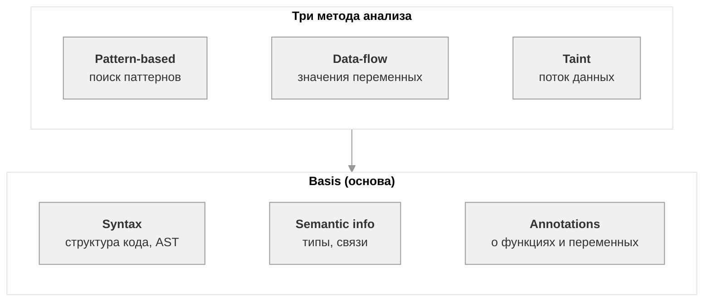

SAST — анализ исходного кода без запуска. Ищет уязвимости и ошибки по таким признакам как: паттерн, структура, поток данных. Все три метода опираются на основу (Basis).

```mermaid
%%{init: {'theme':'base', 'themeVariables': {
  'primaryColor': '#f0f0f0',
  'primaryTextColor': '#333333',
  'primaryBorderColor': '#999999',
  'lineColor': '#999999',
  'fontSize': '14px'
}}}%%
flowchart TD
    subgraph Methods["<b>Три метода анализа</b>"]
        direction LR
        P["<b>Pattern-based</b><br/>поиск паттернов"]
        D["<b>Data-flow</b><br/>значения переменных"]
        T["<b>Taint</b><br/>поток данных"]
        P ~~~ D ~~~ T
    end

    subgraph Basis["<b>Basis (основа)</b>"]
        direction LR
        S["<b>Syntax</b><br/>структура кода, AST"]
        SI["<b>Semantic info</b><br/>типы, связи"]
        AN["<b>Annotations</b><br/>о функциях и переменных"]
        S ~~~ SI ~~~ AN
    end

    Methods --> Basis
```
